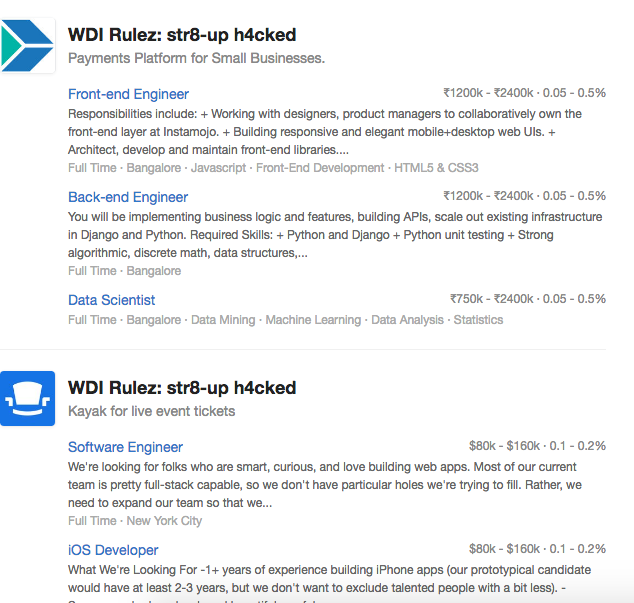

#DOM Manipulation & Events

### Objectives

*After this lesson, students will be able to:*

* Select & modify DOM elements
* Create & append DOM elements
* Style CSS with Javascript
* Set event listeners

### Preparation
*Before this lesson, students should already be able to:*

- Use chrome developer tools to interact with the DOM
- Create javascript objects and functions

Head to the GitHub's [showcase](https://github.com/showcases) section to get started.

##Select & Modify: Str8-up H4cked (15m)

####Mission
Select each showcase element change them all to `WDI Rulez: str8-up h4cked`.

---

Hint:

* How we can identify all the showcase elements? Do they share any HTML attributes?

* Once we've identified an attribute they all share, how can we select them all?
	* Tip: try [`document.querySelectorAll(...)`](https://developer.mozilla.org/en-US/docs/Web/API/Document/querySelectorAll) to grab everything that matches a query. Note this is different to `.querySelector` which just selects the first item it finds.

* Now that we have a collection, how do we change the text off all of them at once?
	* Tip: iterate through the collection and reset the `textContent` of each.

##Create & Append: More Octocat (15m)

####Mission

The internet loves cats. Let's put another octocat icon after the search box.

---

Hint:

* Grab the search box

* Create an span element in the console with the classes `.mega-octicon` and `.octicon-mark-github`

* Add an ID for good measure (it could help us select it again later)
	* Tip: try `setAttribute`

* Append it to the DOM

##Styling with Javascript: Big Kitty (10m)

####Mission

Our octocat is not big or bold enough! Let's increase it's size and give it a fun color.

---

Hint:

`.style`

##Set Event Listeners (10m)

####Mission

Register an event which fires when our octocat is clicked that creates an alert message saying "meow"

---

Hint:

`.addEventListener`

##Bonus Mission

####Mission

When the octocat is hovered-over change its color to grey.

##Conclusion

Today we uncovered some Web API basics that allowed us to interact with the DOM as a whole and elements individually.

####We covered
**General Concepts**

* `for` loop

**Document API**

* `.querySelector`
* `.querySelectorAll`
* `.createElement`

**Element API**

* `.appendChild`
* `.textContent`
* `.setAttribute`
* `.style` (`.<someCSSProperty`)
* `.addEventListener`

####More worth knowing

**Element API**

* `.removeChild`
* `.parentNode`
* `.children`
* `.getAttribute`
* `.removeEventListener`

For documentation reference the Mozilla Developer Network, aka [MDN](https://developer.mozilla.org/en-US/)